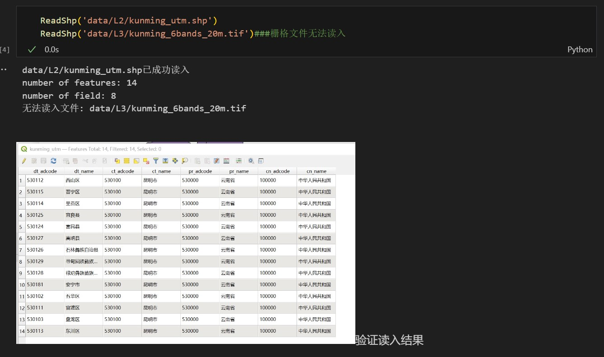
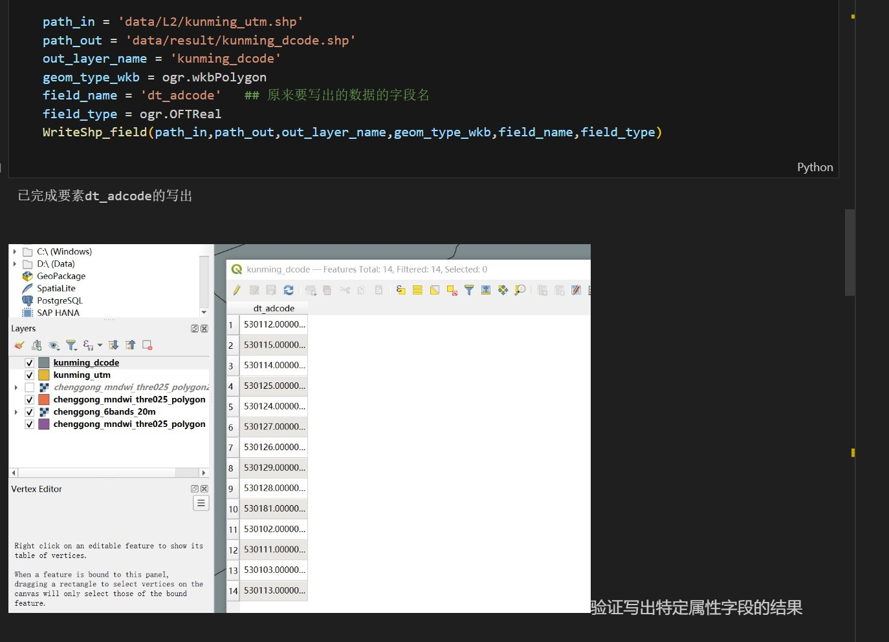
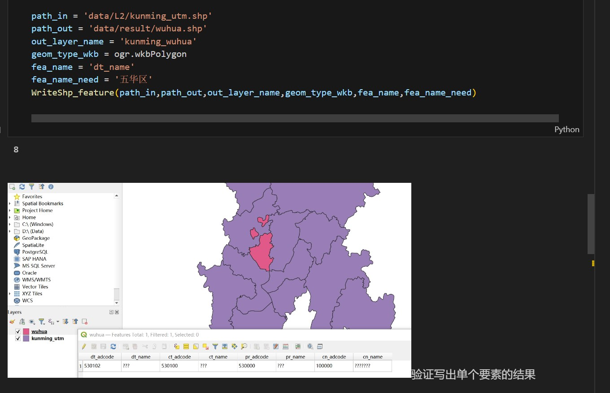
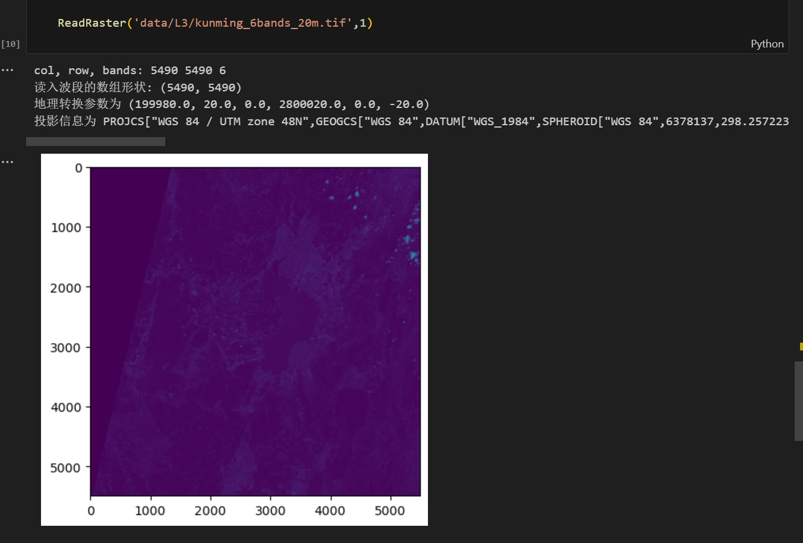
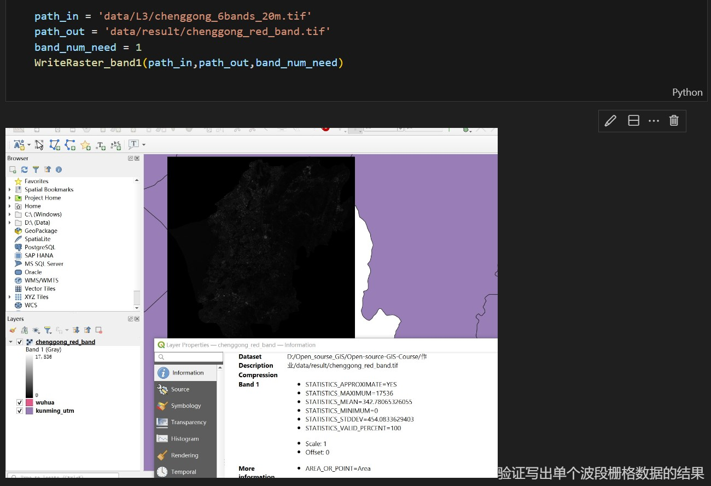

# 读入写出矢量数据和栅格数据函数的编写
连思强 20211170272  

在不使用GeoPandas库的情况下，封装打开/处理/导出矢量数据和栅格数据的代码
## 一、读入矢量数据
#### 1、函数：ReadShp(读取文件路径)  
#### 2、功能：会检查是否成功读入，若成功读入则显示读入的shapefile的要素个数和属性字段数；如果输入的是栅格文件的路径，则显示无法读入  
#### 3、代码如下
```
from osgeo import ogr
def ReadShp(path):
    ds = ogr.Open(path)

    # 检查是否成功打开数据源
    if ds is None:
        print('无法读入文件: {0}'.format(path))
        return None
    
    layer = ds.GetLayer(0)

    feature_count = layer.GetFeatureCount()
    field_count = layer.GetLayerDefn().GetFieldCount()
    print('{0}已成功读入'.format(path))
    print('number of features:', feature_count)##要素个数
    print('number of field:', field_count)##属性字段数

    ds = None

    return feature_count, field_count
```
#### 4、运行结果
---

---
此处为截图  


## 二、写出是矢量数据
### （一）、写出特定字段的矢量数据
#### 1、函数：WriteShp_field(输入矢量数据路径,输出矢量数据路径,输出图层名称,wkb格式的（点线面）,写出的字段名称,字段的类型):
#### 2、功能：从已知的矢量数据中，写出特定字段的矢量数据。输出完成输出的提示信息
#### 3、代码如下
```
def WriteShp_field(path_in,path_out,out_layer_name,geom_type_wkb,field_name,field_type):
    ds = ogr.Open(path_in)
    layer = ds.GetLayer(0)

    driver = ogr.GetDriverByName('ESRI Shapefile')
    ds_out = driver.CreateDataSource(path_out)
    layer_out = ds_out.CreateLayer(out_layer_name, geom_type = geom_type_wkb, srs=layer.GetSpatialRef())
    field_defn = ogr.FieldDefn(field_name,field_type)
    layer_out.CreateField(field_defn)
    fea_defn = layer_out.GetLayerDefn()


    for i in range(layer.GetFeatureCount()):
        fea = layer.GetFeature(i)
        geo = fea.geometry()
        fea_out = ogr.Feature(fea_defn)
        fea_out.SetGeometry(geo)
        field_value = fea.GetField(field_name)
        fea_out.SetField(field_name,field_value)
        layer_out.CreateFeature(fea_out)

    print('已完成要素{0}的写出'.format(field_name))
    
    ds = None
    ds_out = None
```
#### 4、运行结果
---

---
此处为截图

### （二）、写出单个要素的矢量数据
#### 1、函数：WriteShp_feature(输入数据路径,输出数据路径,输出图层名称,wkb格式的点线面,字段名称（列名）,需要写出的要素名称（在制定列中找到制定行）)
#### 2、功能：从已知矢量数据中，写出单个要素的矢量数据。输出写入多少个字段
#### 3、代码如下
```
def WriteShp_feature(path_in,path_out,out_layer_name,geom_type_wkb,fea_name,fea_name_need):
    ds = ogr.Open(path_in)
    layer = ds.GetLayer(0)

    driver = ogr.GetDriverByName('ESRI Shapefile')
    ds_out = driver.CreateDataSource(path_out)
    layer_out = ds_out.CreateLayer(out_layer_name, geom_type = geom_type_wkb, srs=layer.GetSpatialRef())
    fea_defn = layer_out.GetLayerDefn()
    layer_defn = layer_out.GetLayerDefn()

    fea = layer.GetFeature(0)

    for i in range(fea.GetFieldCount()):

        field_defn = fea.GetFieldDefnRef(i)
        layer_out.CreateField(field_defn)
    layer_defn = layer_out.GetLayerDefn()

    print(layer_defn.GetFieldCount())

    for i in range(layer.GetFeatureCount()):
        fea = layer.GetFeature(i)
        if fea.GetField(fea_name) == fea_name_need:
            fea_out = ogr.Feature(fea_defn)
            fea_out.SetGeometry(fea.geometry())
            for i in range(fea.GetFieldCount()):
                field_value = fea.GetField(i)
                fea_out.SetField(i,field_value)
            layer_out.CreateFeature(fea_out)
    ds = None
    ds_out = None
```
#### 4、运行结果
---

---
此处为截图

## 三、读入栅格数据
#### 1、函数：ReadRaster(输入数据的路径,需要读入的波段)
#### 2、功能：读入栅格数据，输出栅格相关信息，如行列号，波段数，读入波段的数组形状，地理转换参数，投影信息，并展示图像
#### 3、代码如下
``````
def ReadRaster(path,band_num):##路径和要读入的波段
    dset = gdal.Open(path)
    x_size,y_size,num_band = dset.RasterXSize, dset.RasterYSize, dset.RasterCount
    print('col, row, bands:',x_size, y_size, num_band)
    band = dset.GetRasterBand(band_num) 
    band_array = band.ReadAsArray()
    print('读入波段的数组形状:',band_array.shape)
    geo_trans = dset.GetGeoTransform()
    print('地理转换参数为',geo_trans) 
    proj = dset.GetProjection()
    print('投影信息为',proj)
    plt.imshow(band_array)
``````
#### 4、运行结果
----

----
此处为截图
## 四、写出单个波段的栅格数据
#### 1、函数：WriteRaster_band1(输入栅格数据路径,输出栅格数据路径,需要写出的波段号)
#### 2、功能：写出单个指定波段的栅格数据
#### 3、代码如下
```
def WriteRaster_band1(path_in,path_out,band_num_need):
    driver = gdal.GetDriverByName('GTiff')
    dset = gdal.Open(path_in)
    outdest = driver.Create(path_out, xsize = dset.RasterXSize, ysize = dset.RasterYSize, bands = 1, eType = gdal.GDT_Int16)  #只有一个波段但行列无变化
    outdest.SetGeoTransform(dset.GetGeoTransform())
    outdest.SetProjection(dset.GetProjection())
    band_need = dset.GetRasterBand(band_num_need)
    band_need_array = band_need.ReadAsArray()
    band_out = outdest.GetRasterBand(1)   #写出数据只含有一个波段
    band_out.WriteArray(band_need_array)
    band_out.SetNoDataValue(np.nan)
    outdest = None
```
#### 4、运行结果
---

---
此处为截图

注：截图中的图片使用html代码修改了大小，具体代码如下：
```
验证读入结果
<!--  该语句无法调整图片大小，本条语句为Markdown注释-->
```