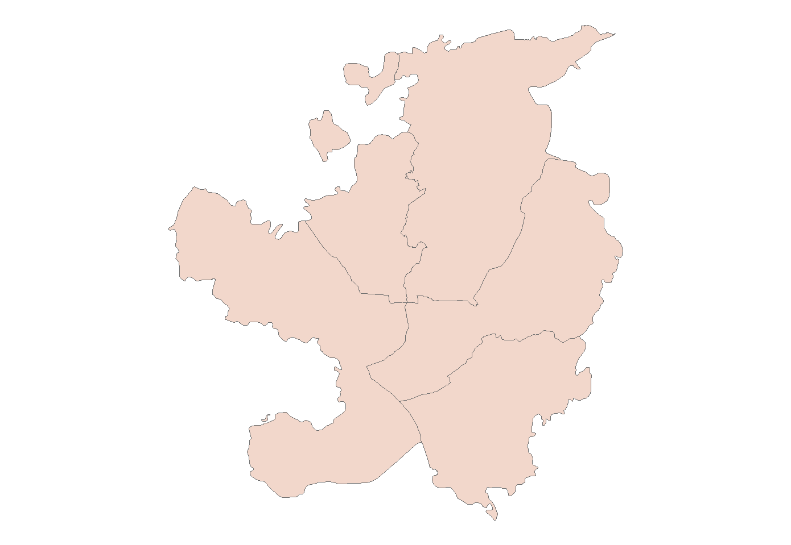
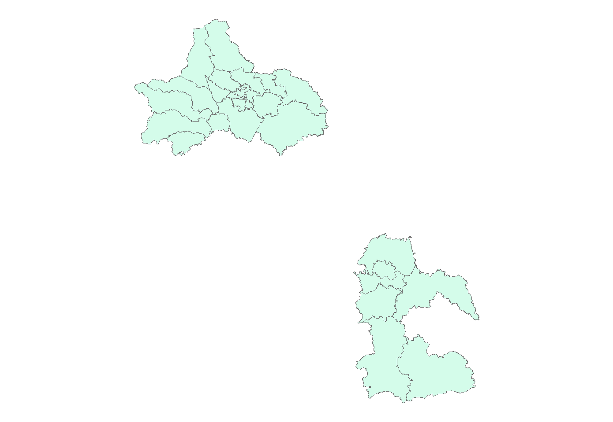
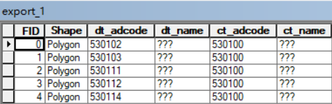
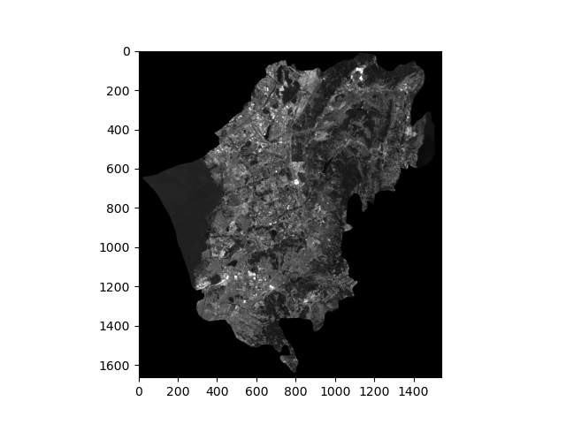
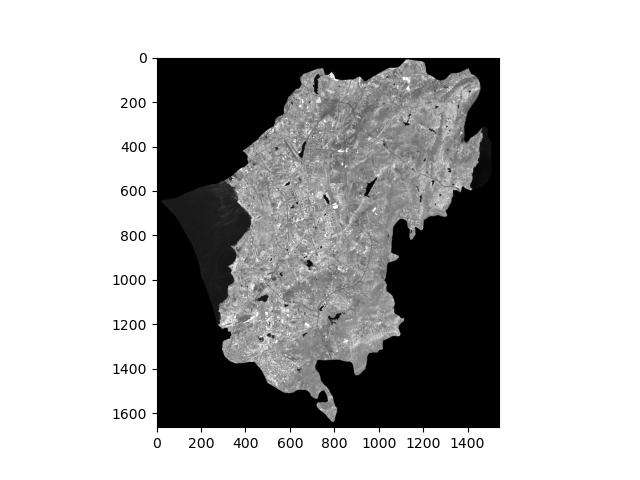
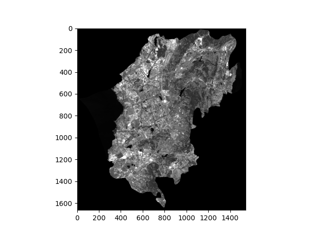
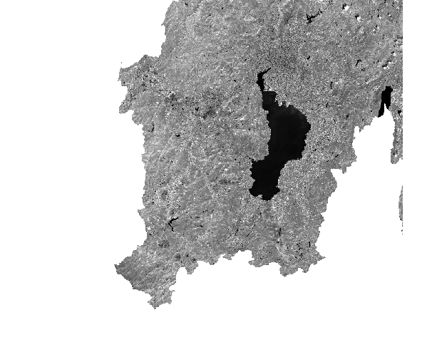

#  第二次个人作业 
**实验名称：矢量数据，栅格数据便捷读写函数及使用演示。**  
**课程名称：开源GIS**  
**姓名：牟兵**  
**学号：20211170130**  
## 矢量数据的读入函数
**相关代码：**  
```python
def ReadShapeFile(path):
    #参数是一个路径
    ds_in = ogr.Open(path,0)
    layer = ds_in.GetLayer(0)
    list_basic = [] #用来记录数据的基本信息的列表
    list_temp = [] #一个临时列表

    #获取图层的要素个数和字段个数
    num_fea = layer.GetFeatureCount()
    list_temp.append(num_fea)
    num_field = layer.GetFeature(0).GetFieldCount()
    list_temp.append(num_field)
    list_basic.append(list_temp)


    list_temp = [] #清空list_temp
    fields = []
    fea = layer.GetFeature(0)
    #获取所有的字段名
    for i in range(0, num_field):
        field = fea.GetFieldDefnRef(i).name
        list_temp.append(field)
        fields.append(field)
    list_basic.append(list_temp)

    #获取每个字段的所对应的值
    for j in range(len(fields)):
        field_name = fields[j]
        list_temp = []
        for i in range(layer.GetFeatureCount()):   
            fea = layer.GetFeature(i)
            list_temp.append(fea.GetField(field_name))
        list_basic.append(list_temp)
    return list_basic
```
ReadShapeFile()这个函数可以通过传入一个shp文件的路径，即可获取这个shp文件的基本信息，它的返回值是一个列表。  


**函数使用示例：**

```python
path = '/mnt/d/out/kunming/chenggong.shp'
list_test = []
list_test = ReadShapeFile(path)
print(list_test)
```
该示例的shp文件是呈贡区的一个矢量文件，它的基本信息存储在List_test这个列表中。 


**返回结果：**
```
[[1, 8], ['dt_adcode', 'dt_name', 'ct_adcode', 'ct_name', 'pr_adcode', 'pr_name', 'cn_adcode', 'cn_name'], ['530114'], ['呈贡区'], ['530100'], ['昆明市'], ['530000'], ['云南省'], ['100000'], ['中华人民共和国']]
```  
**list_test[0]存储该文件的要素个数和要素的字段数。  
list_test[1]存储该文件的字段名。  
后面的元素则存储要素各个字段的值**  

该示例比较特殊，shp文件只有一个要素，如果有x个要素的话，list_test[2]到list_test[end]列表所包含的元素个数都为x个。举个例子list_test[2][1]就代表第二个要素对应的第一个字段的值。  

## 矢量数据的写出函数  
**相关代码：**  
```python
def WriteShapeFile(path_out,name_out,path_in,fields_name,select_limit):
    keys = list(select_limit.keys())  #获取筛选条件的键的名字
    #创建空的输出图层
    ds_in = ogr.Open(path_in,0)
    layer = ds_in.GetLayer(0)
    driver = ogr.GetDriverByName('ESRI Shapefile')  
    ds_out = driver.CreateDataSource(path_out) 
    layer_out = ds_out.CreateLayer(name_out, geom_type=ogr.wkbPolygon, srs=layer.GetSpatialRef())

    #创建输出矢量数据的字段
    for j in range(len(fields_name)):  
        field_defn = ogr.FieldDefn(fields_name[j], ogr.OFTString)  
        print(fields_name[j])  
        layer_out.CreateField(field_defn) 
    fea_defn = layer_out.GetLayerDefn()

    #为输出图层创建要素
    for i in range(layer.GetFeatureCount()):   
        in_fea = layer.GetFeature(i)   
        in_geo = in_fea.geometry()             
        fea_out = ogr.Feature(fea_defn)
        fea_out.SetGeometry(in_geo)

        #判定该in_fea是否满足筛选条件
        for k in range(len(select_limit[keys[0]])):
            if in_fea.GetField(keys[0]) == select_limit[keys[0]][k]:
                print(select_limit[keys[0]][k])
                #满足条件则将in_fea对应的字段值赋值给输出要素
                for j in range(len(fields_name)):     
                    field_value = in_fea.GetField(fields_name[j])  
                    print(field_value) 
                    fea_out.SetField(j, field_value)   
                layer_out.CreateFeature(fea_out)   
    ds_out = None  
```
**参数解释：**
WriteShapeFile(path_out,name_out,path_in,fields_name,select_limit)
- path_out:输出文件路径
- name_out:输出图层名称
- path_in:输入图层路径
- fields_name:输出要素的字段名称，它是列表
- select_limit:筛选条件，它是字典

**函数使用示例：**
```python
fields_name = ['dt_adcode', 'dt_name', 'ct_adcode', 'ct_name']
path_out = '/mnt/d/out/work2/export_1.shp'
name_out = 'test'
path_in = '/mnt/d/ChinaAdminDivisonSHP/4. District/district.shp'
select_limit = {
    'dt_name':['呈贡区','盘龙区','西山区','官渡区','五华区']
    # 'ct_name':['泸州市','成都市']
}
WriteShapeFile(path_out,name_out,path_in,fields_name,select_limit)
```
**输出结果：**  



  

**该函数仅适用于从一个shp文件中输出一个新的shp文件**  
我使用了两次这个函数，它们只是select_limit不一样，通过测试，设置不同字段以及需要筛选的值，该函数都可以正常运行。如输出结果所示，成功筛选出昆明市的五个区（筛选条件为'dt_name':['呈贡区','盘龙区','西山区','官渡区','五华区']）和泸州市和成都市（筛选条件为'ct_name':['泸州市','成都市']）。  
**但是该函数目前只支持一个筛选条件，还未实现复杂的筛选.**  

## 栅格数据的读入函数  
**相关代码：**  
```python
def ReadRaster(path):
    dict_basic = {} #存储多读取的栅格数据的基本信息
    dset = gdal.Open(path)
    #栅格的尺寸和波段数
    x_size, y_size, num_band = dset.RasterXSize, dset.RasterYSize, dset.RasterCount  
    #存储栅格数据各个波段的信息
    bands = [None] * num_band 
    for i in range(num_band):
        band = dset.GetRasterBand(i+1)
        band_array = band.ReadAsArray() 
        bands[i] = band_array  
    #获取地理转换参数
    geo_trans = dset.GetGeoTransform()  
    #获取投影信息
    proj = dset.GetProjection()   
    #将上面操作所提取到的信息存储到字典中
    dict_basic.update({
        'xSize':x_size,
        'ySize':y_size,
        'numBand':num_band,
        'bandArray':bands,
        'geoTrans':geo_trans,
        'proj':proj,
    })
    return dict_basic
```
**函数使用示例：**
```python
path = '/mnt/d/out/kunming/chenggong_final.tif'
test_dict = ReadRaster(path)
print(test_dict)
plt.figure()
plt.imshow(test_dict['bandArray'][0], vmax=4000, vmin=0, cmap='gray')
plt.savefig('image.png')
```
**输出结果：**    
```
{'xSize': 1544, 'ySize': 1664, 'numBand': 6,
 'bandArray': [array([[0, 0, 0, ..., 0, 0, 0],
       [0, 0, 0, ..., 0, 0, 0],
       [0, 0, 0, ..., 0, 0, 0],
       ...,
       [0, 0, 0, ..., 0, 0, 0],
       [0, 0, 0, ..., 0, 0, 0],
       [0, 0, 0, ..., 0, 0, 0]], dtype=uint16), 

       array([[0, 0, 0, ..., 0, 0, 0],
       [0, 0, 0, ..., 0, 0, 0],
       [0, 0, 0, ..., 0, 0, 0],
       ...,
       [0, 0, 0, ..., 0, 0, 0],
       [0, 0, 0, ..., 0, 0, 0],
       [0, 0, 0, ..., 0, 0, 0]], dtype=uint16), 

       array([[0, 0, 0, ..., 0, 0, 0],
       [0, 0, 0, ..., 0, 0, 0],
       [0, 0, 0, ..., 0, 0, 0],
       ...,
       [0, 0, 0, ..., 0, 0, 0],
       [0, 0, 0, ..., 0, 0, 0],
       [0, 0, 0, ..., 0, 0, 0]], dtype=uint16), 

       array([[0, 0, 0, ..., 0, 0, 0],
       [0, 0, 0, ..., 0, 0, 0],
       [0, 0, 0, ..., 0, 0, 0],
       ...,
       [0, 0, 0, ..., 0, 0, 0],
       [0, 0, 0, ..., 0, 0, 0],
       [0, 0, 0, ..., 0, 0, 0]], dtype=uint16), 

       array([[0, 0, 0, ..., 0, 0, 0],
       [0, 0, 0, ..., 0, 0, 0],
       [0, 0, 0, ..., 0, 0, 0],
       ...,
       [0, 0, 0, ..., 0, 0, 0],
       [0, 0, 0, ..., 0, 0, 0],
       [0, 0, 0, ..., 0, 0, 0]], dtype=uint16), 

       array([[0, 0, 0, ..., 0, 0, 0],
       [0, 0, 0, ..., 0, 0, 0],
       [0, 0, 0, ..., 0, 0, 0],
       ...,
       [0, 0, 0, ..., 0, 0, 0],
       [0, 0, 0, ..., 0, 0, 0],
       [0, 0, 0, ..., 0, 0, 0]], dtype=uint16)],

        'geoTrans': '(874080.0, 20.0, 0.0, 2769840.0, 0.0, -20.0)',

        'proj': 'PROJCS["WGS 84 / UTM zone 47N",GEOGCS["WGS 84",DATUM["WGS_1984",SPHEROID["WGS 84",6378137,298.257223563,AUTHORITY["EPSG","7030"]],AUTHORITY["EPSG","6326"]],PRIMEM["Greenwich",0,AUTHORITY["EPSG","8901"]],UNIT["degree",0.0174532925199433,AUTHORITY["EPSG","9122"]],AUTHORITY["EPSG","4326"]],PROJECTION["Transverse_Mercator"],PARAMETER["latitude_of_origin",0],PARAMETER["central_meridian",99],PARAMETER["scale_factor",0.9996],PARAMETER["false_easting",500000],PARAMETER["false_northing",0],UNIT["metre",1,AUTHORITY["EPSG","9001"]],AXIS["Easting",EAST],AXIS["Northing",NORTH],AUTHORITY["EPSG","32647"]]'}
```



ReadRaster(path)函数,输入参数为一个栅格数据的路径，它的返回值为一个字典，它包含了这个栅格数据的基本信息（影像尺寸，波段数，各个波段数组，地理转换参数，投影）。为了验证ReadRaster()是否正常运行，我利用返回的字典中的波段数组绘制了以上三幅图，它们都是该栅格数据的某个波段说绘制出来的。  

## 栅格数据的读入函数  
**相关代码：**    
```python
def WriteRaster(path,xsize,ysize,numband,geotrans,proj,bandarray):
    driver = gdal.GetDriverByName("GTiff")  
    outdset = driver.Create(path, xsize, ysize,numband, eType=gdal.GDT_Int16) 
    outdset.SetGeoTransform(geotrans) 
    outdset.SetProjection(proj)           
    outband = outdset.GetRasterBand(1)    
    outband.WriteArray(bandarray)      
    outband.SetNoDataValue(np.nan)        
    outdset = None   
```
**参数解释：**
WriteRaster(path,xsize,ysize,numband,geotrans,proj,bandarray)
- path:输出栅格文件路径
- xsize:输出栅格文件像元的列数
- ysize:输出栅格文件像元的行数
- numband:输出栅格文件的波段数
- geotrans:输出栅格文件的地理转换参数
- proj:输出栅格文件的投影信息
- bandarray:存储波段的像元值  
  
**函数使用示例：**
```python
path = '/mnt/d/out/kunming/kunming.tif'
test_dict = ReadRaster(path)
path_out = '/mnt/d/out/work2/homework2.tif'
xsize = test_dict['xSize']
ysize = test_dict['ySize']
numband = 1
geotrans = test_dict['geoTrans']
proj = test_dict['proj']
bandarray = test_dict['bandArray'][3]
WriteRaster(path_out,xsize,ysize,numband,geotrans,proj,bandarray)
```
本示例还是用到了栅格的读入函数，构造新栅格的信息都来自于读入的那个栅格，此示例相当于波段裁剪，输出的栅格只有原来栅格的一个波段，其他信息一样。

**输出结果：**   

